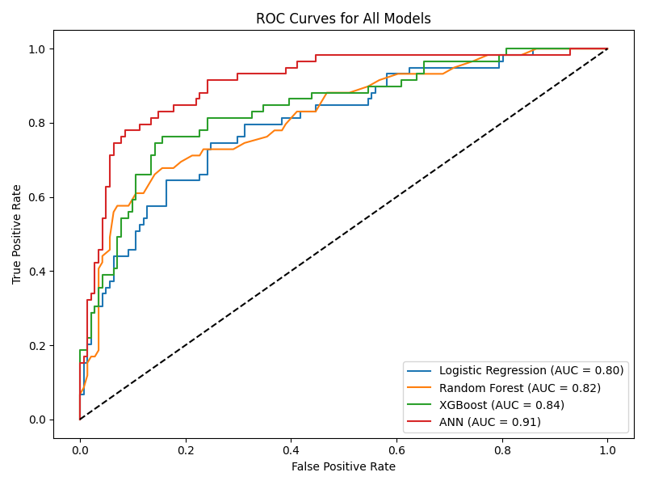
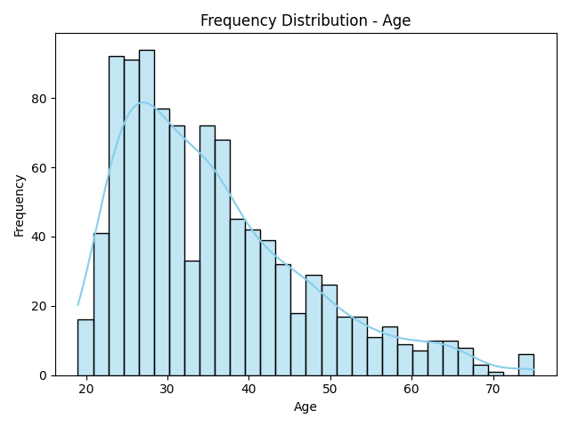
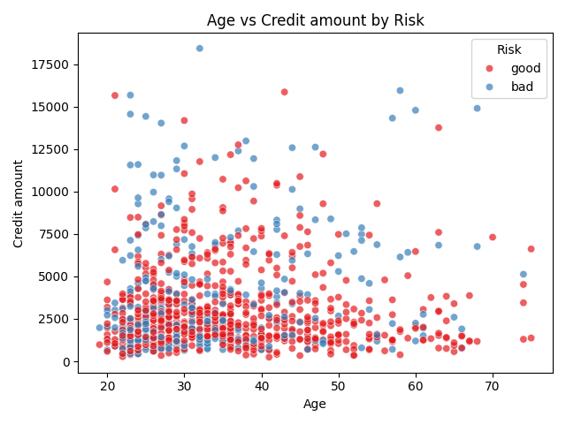

# Credit Risk ML System

A machine learning project for **credit-risk classification** using the German Credit dataset.

The project explores data preprocessing, class balancing, neural networks, traditional machine-learning models, evaluation metrics, and visual analysis to compare different approaches for identifying higher-risk credit applicants.

## Project Highlights

- German Credit dataset with **1,000 records**
- Data preprocessing and standardization
- Class balancing using **SMOTE**
- Artificial Neural Network built with TensorFlow/Keras
- Comparison against:
  - Logistic Regression
  - Random Forest
  - XGBoost
- Evaluation using:
  - Accuracy
  - Precision
  - Recall
  - F1-score
  - ROC-AUC
  - ROC curves
- Automated exploratory visualizations

## Models

### Artificial Neural Network

The ANN uses the following architecture:

```text
24 input features
      ↓
Dense(64, ReLU)
      ↓
Dense(32, ReLU)
      ↓
Dense(1, Sigmoid)
```

The model is trained using:

- Adam optimizer
- Binary cross-entropy loss
- 20 training epochs
- Batch size of 32

### Comparison Models

The project also evaluates:

- Logistic Regression
- Random Forest
- XGBoost

## Current Saved Results

The current saved comparison report in the repository produced:

| Model | Accuracy | Bad-Credit Recall | Bad-Credit F1 |
|---|---:|---:|---:|
| Logistic Regression | 78% | 0.51 | 0.57 |
| Random Forest | 80% | 0.46 | 0.57 |
| XGBoost | 80% | 0.54 | 0.62 |
| ANN | **83%** | **0.85** | **0.75** |

For credit-risk analysis, identifying bad-credit cases is especially important because incorrectly classifying a bad customer as good carries a higher cost in the dataset's documented cost matrix.

## ROC Comparison



## Exploratory Analysis

The project generates multiple visualizations automatically.

### Feature Distributions

Examples include distributions for:

- Age
- Credit amount
- Credit duration
- Job category

Example:



### Features vs Credit Risk

The project also compares individual variables against the credit-risk label.


### Feature Combinations

Pairwise feature relationships are visualized against credit risk.



## Project Structure

```text
credit-risk-ml-system/
│
├── nnfl/
│   ├── ann.py
│   ├── ann_model.h5
│   ├── comparison.py
│   ├── evaluation.py
│   ├── main.py
│   ├── model.py
│   ├── preprocessing.py
│   ├── visualization.py
│   │
│   ├── german.data
│   ├── german.data-numeric
│   ├── german.doc
│   ├── german_credit_data.csv
│   │
│   └── output/
│       ├── comparison/
│       ├── frequency/
│       ├── compare_vs_risk/
│       └── combo_vs_risk/
│
├── README.md
├── requirements.txt
└── .gitignore
```

## Pipeline

```text
German Credit Dataset
        ↓
Data Cleaning
        ↓
Feature Standardization
        ↓
SMOTE Class Balancing
        ↓
Train / Test Split
        ↓
Model Training
        ↓
ANN + Traditional ML Models
        ↓
Evaluation
        ↓
ROC / Classification Reports
        ↓
Visual Analysis
```

## Dataset

The repository includes the German Credit dataset and its accompanying documentation.

The numeric version contains:

- **1,000 instances**
- **24 numerical input attributes**
- binary credit-risk classification

The original dataset documentation also defines an asymmetric cost matrix: classifying a bad customer as good is considered more costly than classifying a good customer as bad.

## Running the Project

Clone the repository and move into the project folder:

```bash
git clone https://github.com/Jonah005/credit-risk-ml-system.git
cd credit-risk-ml-system/nnfl
```

Install dependencies:

```bash
pip install -r ../requirements.txt
```

Run the main pipeline:

```bash
python main.py
```

Run the ANN training script separately:

```bash
python ann.py
```

Run model comparison:

```bash
python comparison.py
```

Generate visualizations:

```bash
python visualization.py
```

## Tech Stack

- Python
- TensorFlow / Keras
- Scikit-learn
- XGBoost
- Pandas
- NumPy
- Imbalanced-learn / SMOTE
- Matplotlib
- Seaborn

## Output

Generated results are stored inside:

```text
nnfl/output/
```

including classification reports, ROC comparisons, feature distributions, risk comparisons, and pairwise visualizations.

## Notes

This project was developed as an academic machine-learning project exploring credit-risk prediction and model comparison. The repository is preserved as a portfolio demonstration of preprocessing, neural-network modeling, traditional machine-learning baselines, evaluation, and visualization.
